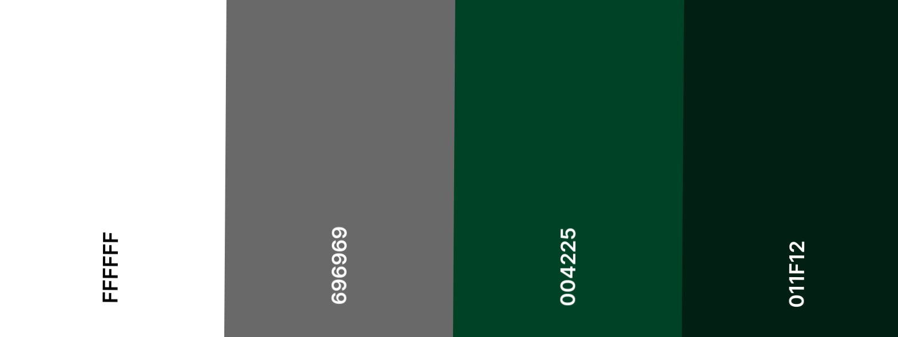

# *Plant Swap* - Third Milestone Project for Code Institute 
*Plant Swap* was created for plant enthusiasts around the world who are looking to adopt new plants while making sure their unwanted plants go to a good home. 

At *Plant Swap* we truly believe in "One Man's Trash Is Another Man's Treasure". Why spend money on a new plant when you can simply swap instead? 

A live preview of the site can be found here: [Plant Swap](https://plant-swap-ci.herokuapp.com/)
## Table of Contents
1. [UX Design](#ux-design)
    * [User Stories](#user-stories)
    * [Strategy](#strategy)
    * [Scope](#scope)
    * [Structure](#structure)
    * [Skeleton](#skeleton)
1. [Features](#features)
1. [Technologies Used](#technologies-used)
1. [Testing](#testing)
1. [Deployment](#deployment)
1. [Credits](#credits)

## UX Design
### User Stories
#### New Users:
* I want the ability to quickly learn about what the website offers.
* I want the ability to create an account so I can view posts and create my own posts.
#### Existing Users:
* I want the ability to log in to my account.
* I want the ability to see all available posts.
* I want the ability to contact someone about their post.
* I want the ability to filter all posts on location.
* I want the ability to create posts.
* I want the ability to edit my own posts.
* I want the ability to delete my own posts.
* I want the ability to log out of my account.
* I want the ability to delete my account and posts.

### Strategy
The primary goal of this website is to offer users an easy way to get in touch with others so they can swap plants. In order to accomplish this, the website is as minimalistic as possible and has simple navigation on every page. As a wide variety of users will visit *Plant Swap* the layout of the website will respect this and be straightforward and easily accessible to all. 
### Scope
The users need the following from the website: 
* A Landing Page that is easy to navigate. 
* A footer and navigation bar that change depending on whether the user is logged in or not. 
* A register and login form for users to either create a new account or to log in.
* A My Account Page for users to view/edit/delete their posts, and an option to delete their account. 
* A Sign Out button that is easy to find on every page (preferably in the navigation bar).
* An About page for both users and new visitors to see what the website does and how to use the website. 
* A Posts page where users can see all the posts on the website.
* A way to filter posts so users can see the plants available in their area. 
### Structure
Flask was used for this project in order to make an interactive website that sends users to different links/pages depending on their input.

A traditional navigation bar was implemented at the top of each page with the common "Tree Structure". This bar changes depending on whether a user is current logged in. If so, it includes links to the Posts, My Account, Add Post, and How To Swap pages. If not, it includes links to the Home, Log In, Register, and How To Swap pages.

**Color Scheme**: The background of the website, footer and navigation bar are all white. This allowed the focus to be on the content of the pages. Dark gray was used for all of the font on the website. Buttons and links were done in two different shades of green, as green is usually the color associated with plants. The only other color used was red for errors and delete buttons. Red was chosen because it stands out from the rests and alerts users about the error or that they are about to delete something.  

**Typography**: [Questrial](https://fonts.google.com/specimen/Questrial?sidebar.open=true&selection.family=Questrial) was used for the entire website. 

**Icons**: Icons from [FontAwesome](https://fontawesome.com/) were used in the footer for Social Media links in order to minimize text used. 

### Skeleton 
[Click here](wireframes) to see all wireframes for this project. 

*Please note that the wireframes show the initial design ideas for the website and therefore may not match the current version.*
## Features

## Technologies Used

## Testing

## Deployment

## Credits
